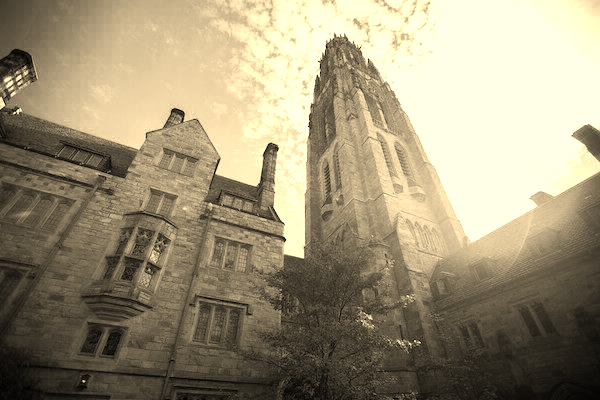

# Filter (less)
A program written in C that applies filters to BMP files.

## Filters
* Grayscale
* Sepia
* Reflection
* Blur

**Grayscale**

One common basic filter is "grayscale" filter which is used to convert the image to black-and-white. 

**Sepia**

"Sepia" will gives images an old-timey feel by the whold image look a bit reddish-brown. Formula of sepia filter is as below.
    
    sepiaGreen = .349 * originalRed + .686 * originalGreen + .168 * originalBlue
    sepiaBlue = .272 * originalRed + .534 * originalGreen + .131 * originalBlue

**Reflection**

Any pixels on the left side of the image should end up on the right, and vice versa. In such way, the filter will create reflected image.

**Blur**

Using the "Box Blur" algorithm, the filter will create the effect of bluring or softening an image.

See more information [here](https://cs50.harvard.edu/x/2020/psets/4/filter/less).

---

## How to Compile
    make filter

## Usage
    Usage: filter [flag] infile outfile
>
    Flag [flag]
     -b  blur
     -g  grayscale
     -r  reflect
     -s  sepia

## Examples

**Blur**

    ./filter -b images/tower.bmp output/blur.bmp

**Grayscale**

    ./filter -g images/tower.bmp output/grayscale.bmp

**Reflection**

    ./filter -r images/tower.bmp output/reflection.bmp

**Sepia**

    ./filter -s images/tower.bmp output/sepia.bmp