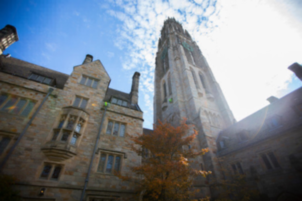
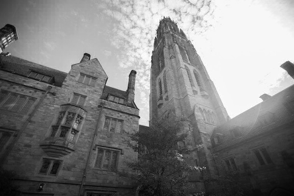
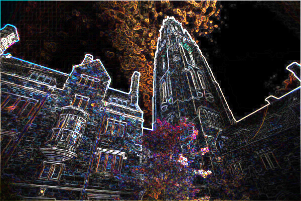

# Filter (more)
A program written in C that applies filters to BMP files.

## Filters
* Grayscale
* Reflection
* Blur
* Edges *(new)*

**Grayscale**

One common basic filter is "grayscale" filter which is used to convert the image to black-and-white. 

**Reflection**

Any pixels on the left side of the image should end up on the right, and vice versa. In such way, the filter will create reflected image.

**Blur**

Using the "Box Blur" algorithm, the filter will create the effect of bluring or softening an image.

**Edges**

Edge detection is an image processing technique which is commonly used in  artificial integellience for finding the boundries of objects within images. Using **Sobel filter** algorithm, the program will be able to detect the edges in an image.

Formula of Sobel filter is as below.

    red = the square root of Gx^2 + Gy^2
          

See more information [here](https://cs50.harvard.edu/x/2020/psets/4/filter/more).

---

## How to Compile
    make filter

## Usage
    Usage: filter [flag] infile outfile
>
    Filters [flag]
     -e  edges
     -b  blur
     -g  grayscale
     -r  reflection

## Examples

**Blur**

    ./filter -b images/tower.bmp output/blur.bmp

**Grayscale**

    ./filter -g images/tower.bmp output/grayscale.bmp

**Edge**

    ./filter -r images/tower.bmp output/edge.bmp

**Reflection**

    ./filter -r images/tower.bmp output/reflection.bmp